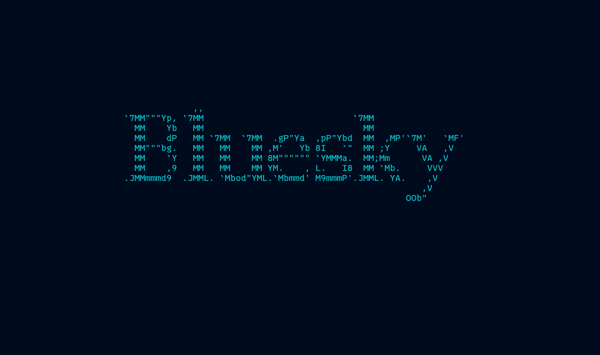

# bsky_tui
Bluesky client for the terminal



## Overview

bsky_tui is a terminal-based client for Bluesky. Through a command-line interface, you can access the main features of Bluesky. Using a Text User Interface (TUI), you can efficiently browse timelines, create posts, like, repost, reply, and more using just your keyboard.

## Features

- View and browse home timeline
- View and browse notifications
- Search for posts
- Create new posts
- Reply to posts
- Like/unlike posts
- Repost/unrepost posts
- Open posts in browser

## Installation

### Build from source

```bash
git clone https://github.com/ksk001100/bsky_tui
cd bsky_tui
cargo install --path .
```

### Install using Cargo

```bash
cargo install bsky_tui
```

## Configuration

You need to generate a configuration file on first launch:

```bash
bsky_tui config
```

This will generate a configuration file at:
- Linux/macOS: `~/.config/bsky_tui/config.toml`
- Windows: `~\AppData\Roaming\bsky_tui\config.toml`

Edit the generated configuration file and set the following required fields:

```toml
email = "your.email@example.com"  # Your Bluesky account email
password = "your_password"        # Your Bluesky account password
skip_splash = false               # Whether to skip the splash screen (optional)
splash_path = ""                  # Path to a custom splash screen (optional)
```

## Usage

```bash
# Show help
bsky_tui --help

# Generate config file
bsky_tui config

# Launch the application
bsky_tui
```

## Keybindings

### Common
- `q`, `Esc`, `Ctrl+c`: Exit
- `Tab`: Switch tabs (Home → Notifications → Search → Home)
- `?`: Show help

### Home Tab
- `j`, `Down`, `Ctrl+n`: Scroll down
- `k`, `Up`, `Ctrl+p`: Scroll up
- `h`, `Left`: Previous page
- `l`, `Right`: Next page
- `r`: Reload timeline
- `n`: New post
- `N`: Reply to selected post
- `Ctrl+l`: Like/unlike
- `Ctrl+r`: Repost/unrepost
- `Enter`: Open selected post in browser
- `/`: Switch to search mode

### Notifications Tab
- `j`, `Down`, `Ctrl+n`: Scroll down
- `k`, `Up`, `Ctrl+p`: Scroll up
- `r`: Reload notifications
- `/`: Switch to search mode

### Search Tab
- `j`, `Down`, `Ctrl+n`: Scroll down
- `k`, `Up`, `Ctrl+p`: Scroll up
- `h`, `Left`: Previous page
- `l`, `Right`: Next page
- `r`: Reload search results
- `N`: Reply to selected post
- `Ctrl+l`: Like/unlike
- `Ctrl+r`: Repost/unrepost
- `Enter`: Open selected post in browser
- `/`: Switch to search mode

### Post/Reply Mode
- `Esc`: Cancel
- `Enter`: Send post/reply
- `Left`, `Ctrl+b`: Move cursor left
- `Right`, `Ctrl+f`: Move cursor right
- `Ctrl+a`: Move cursor to start
- `Ctrl+e`: Move cursor to end
- `Backspace`, `Ctrl+h`: Delete previous character

### Search Input Mode
- `Esc`: Cancel
- `Enter`: Execute search
- `Left`, `Ctrl+b`: Move cursor left
- `Right`, `Ctrl+f`: Move cursor right
- `Ctrl+a`: Move cursor to start
- `Ctrl+e`: Move cursor to end
- `Backspace`, `Ctrl+h`: Delete previous character

## Development

### Dependencies

- [crossterm](https://github.com/crossterm-rs/crossterm): Terminal manipulation
- [ratatui](https://github.com/ratatui-org/ratatui): TUI framework
- [tokio](https://github.com/tokio-rs/tokio): Async runtime
- [bsky-sdk](https://github.com/sugyan/bsky-sdk): Bluesky SDK
- [atrium-api](https://github.com/sugyan/atrium): Bluesky API client
- [seahorse](https://github.com/ksk001100/seahorse): CLI framework

### Build

```bash
cargo build
```

### Test

```bash
cargo test
```

## License

See the [LICENSE](LICENSE) file.

## Contributing

1. Fork this repository
2. Create a feature branch (`git checkout -b my-new-feature`)
3. Commit your changes (`git commit -am 'Add some feature'`)
4. Push to the branch (`git push origin my-new-feature`)
5. Create a new Pull Request

## Author

- Keisuke Toyota ([@ksk001100](https://github.com/ksk001100))
