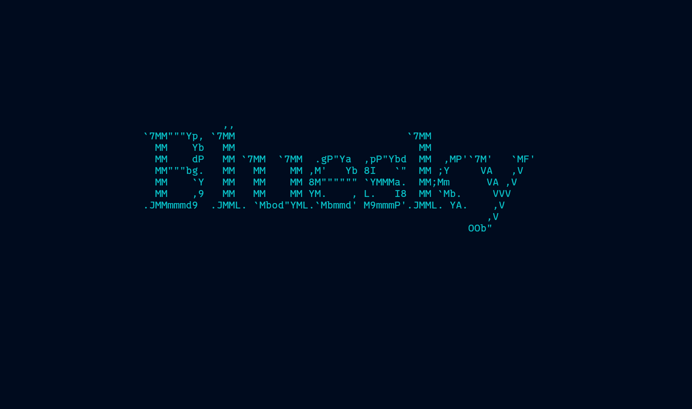

# bsky_tui
Bluesky client for the terminal



## Overview

bsky_tui is a terminal-based client for Bluesky. Through a command-line interface, you can access the main features of Bluesky. Using a Text User Interface (TUI), you can efficiently browse timelines, create posts, like, repost, reply, and more using just your keyboard.

## Features

- View and browse home timeline
- Display profile pictures and post image attachments in supported terminals
- View and browse notifications
- Search for posts
- Search for users
- View profiles, profile posts/replies/media/likes, feeds, lists, and starter packs
- Follow/unfollow users and browse followers/following
- Mute, block, and report profiles or posts with confirmation
- Switch between Following, Discover, saved, pinned, and searched custom feeds
- Create image, link-card, quote, and multi-post thread posts
- Set post languages, content warnings, and reply controls
- View post threads and reply trees
- View quote posts, external link cards, and video/GIF metadata
- Open URLs, mentions, hashtags, external links, and videos
- Browse users who liked or reposted a post, and posts quoting it
- Create new posts
- Reply to posts
- Like/unlike posts
- Repost/unrepost posts
- Open posts in browser

## Installation

### Build from source

```bash
git clone https://github.com/ksk001100/bsky_tui
cd bsky_tui
cargo install --path .
```

### Install using Cargo

```bash
cargo install bsky_tui
```

## Configuration

You need to generate a configuration file on first launch:

```bash
bsky_tui config
```

This will generate a configuration file at:
- Linux/macOS: `~/.config/bsky_tui/config.toml`
- Windows: `~\AppData\Roaming\bsky_tui\config.toml`

Edit the generated configuration file and set the following required fields:

```toml
identifier = "your.email@example.com" # Your Bluesky account email or handle
service_url = "https://bsky.social" # Your PDS/service URL
skip_splash = false               # Whether to skip the splash screen (optional)
splash_path = ""                  # Path to a custom splash screen (optional)
```

Create an App Password in Bluesky under **Settings → Privacy and security → App passwords**,
then store it in the operating system's credential store. Input is hidden and confirmed before
the credential is saved:

```bash
bsky_tui credentials set
```

This uses macOS Keychain, the Linux Secret Service (for example GNOME Keyring or KWallet), or
Windows Credential Manager. The App Password is not stored in `config.toml` or in the UI state.
Existing `email` entries remain supported as an alias for `identifier`; remove any old `password`
entry from the file. The credential is read only during authentication and its in-process buffer
is cleared after use.

On a headless Linux system without Secret Service, the environment variable remains available as
a fallback:

```bash
BSKY_TUI_APP_PASSWORD="xxxx-xxxx-xxxx-xxxx" bsky_tui
```

Delete the saved credential with `bsky_tui credentials delete`.

## Usage

```bash
# Show help
bsky_tui --help

# Generate config file
bsky_tui config

# Save the App Password in the OS keyring
bsky_tui credentials set

# Launch the application
bsky_tui
```

Image rendering uses the best protocol detected for the current terminal. Kitty-compatible
terminals use the Kitty graphics protocol; unsupported terminals fall back to a compatible
text-cell rendering mode.

## Keybindings

### Common
- `q`, `Esc`, `Ctrl+c`: Exit
- `Tab`: Switch tabs (Home → Notifications → Search → Home)
- `?`: Show help
- `u`: Search for users
- `p`: Open the selected post author profile (where available)
- `m`, `B`, `!`: Mute/unmute, block/unblock, or report (with confirmation)
- `D`: Delete the selected post when it belongs to you (with confirmation)
- `X`: Quote the selected post

### Home Tab
- `j`, `Down`, `Ctrl+n`: Scroll down
- `k`, `Up`, `Ctrl+p`: Scroll up
- `h`, `Left`: Previous page
- `l`, `Right`: Next page
- `r`: Reload timeline
- `c`: Open the feed selector
- `n`: New post
- `N`: Reply to selected post
- `Ctrl+l`: Like/unlike
- `Ctrl+r`: Repost/unrepost
- `Enter`: Open attached images
- `b`: Open selected post in browser
- `t`: Open selected post thread
- `e`: Open an external link or video embed
- `f`: Select a URL, mention, or hashtag from the post
- `L`, `R`, `Q`: Show Likes, Reposts, or Quotes
- `/`: Switch to search mode

### Notifications Tab
- `j`, `Down`, `Ctrl+n`: Scroll down
- `k`, `Up`, `Ctrl+p`: Scroll up
- `r`: Reload notifications
- `h`, `Left`: Previous page
- `l`, `Right`: Next page
- `/`: Switch to search mode

### Search Tab
- `j`, `Down`, `Ctrl+n`: Scroll down
- `k`, `Up`, `Ctrl+p`: Scroll up
- `h`, `Left`: Previous page
- `l`, `Right`: Next page
- `r`: Reload search results
- `N`: Reply to selected post
- `Ctrl+l`: Like/unlike
- `Ctrl+r`: Repost/unrepost
- `Enter`: Open attached images
- `b`: Open selected post in browser
- `t`: Open selected post thread
- `e`: Open an external link or video embed
- `f`: Select a URL, mention, or hashtag from the post
- `L`, `R`, `Q`: Show Likes, Reposts, or Quotes
- `/`: Switch to search mode

### Thread Viewer
- `j`, `Down`, `Ctrl+n`: Move down through the thread
- `k`, `Up`, `Ctrl+p`: Move up through the thread
- `b`: Open the selected post in browser
- `e`: Open an external link or video embed
- `f`: Select a URL, mention, or hashtag from the post
- `L`, `R`, `Q`: Show Likes, Reposts, or Quotes
- `q`, `Esc`: Close the thread

### Profile Viewer
- `h`, `Left`: Previous profile section
- `l`, `Right`: Next profile section
- `j`, `Down`, `Ctrl+n`: Move down
- `k`, `Up`, `Ctrl+p`: Move up
- `F`: Follow/unfollow the profile
- `m`, `B`, `!`: Mute/unmute, block/unblock, or report the profile
- `g`: Show followers
- `G`: Show following
- `p`: Open the selected post author profile
- `t`: Open the selected post thread
- `Enter`, `b`: Open the selected post, feed, list, or starter pack
- `q`, `Esc`: Close the profile

### Facet and Interaction Lists
- `j`, `Down`: Move down
- `k`, `Up`: Move up
- `Enter`, `b`: Open the selected item in browser
- `q`, `Esc`: Close the list

### Feed Selector
- `j`, `Down`: Move down
- `k`, `Up`: Move up
- `Enter`: Switch to the selected feed
- `/`: Search custom feeds
- `s`: Save or unsave a custom feed
- `q`, `Esc`: Close the selector

### Image Viewer
- `h`, `Left`: Previous image
- `l`, `Right`: Next image
- `q`, `Esc`: Close image viewer

### Post/Reply Mode
- `Esc`: Cancel
- `Enter`: Insert a newline
- `Ctrl+s`: Send post/reply
- `Ctrl+v`: Preview the first `!link` card
- `Left`, `Ctrl+b`: Move cursor left
- `Right`, `Ctrl+f`: Move cursor right
- `Ctrl+a`: Move cursor to start
- `Ctrl+e`: Move cursor to end
- `Backspace`, `Ctrl+h`: Delete previous character

Composer directives are placed on their own lines and are removed from the published text:

```text
!image /path/to/image.png | Accessible alt text
!link https://example.com/article
!lang ja,en
!label nudity
!replies followers,mentioned
Post body
---
Second post in the same thread
```

- Up to four images and 1 MB per image are accepted; dimensions are used for the aspect ratio.
- `!replies` accepts `everyone`, `none`, or a comma-separated combination of `followers`, `following`, and `mentioned`.
- Separate thread posts with a line containing only `---`.
- `X` pre-fills the internal `!quote AT_URI | CID` directive for the selected post.

### Post/User Search Input Mode
- `Esc`: Cancel
- `Enter`: Execute search
- `Left`, `Ctrl+b`: Move cursor left
- `Right`, `Ctrl+f`: Move cursor right
- `Ctrl+a`: Move cursor to start
- `Ctrl+e`: Move cursor to end
- `Backspace`, `Ctrl+h`: Delete previous character

## Development

### Dependencies

- [crossterm](https://github.com/crossterm-rs/crossterm): Terminal manipulation
- [ratatui](https://github.com/ratatui-org/ratatui): TUI framework
- [tokio](https://github.com/tokio-rs/tokio): Async runtime
- [bsky-sdk](https://github.com/sugyan/bsky-sdk): Bluesky SDK
- [atrium-api](https://github.com/sugyan/atrium): Bluesky API client
- [seahorse](https://github.com/ksk001100/seahorse): CLI framework

### Build

```bash
cargo build
```

### Test

```bash
cargo test
```

## License

See the [LICENSE](LICENSE) file.

## Contributing

1. Fork this repository
2. Create a feature branch (`git checkout -b my-new-feature`)
3. Commit your changes (`git commit -am 'Add some feature'`)
4. Push to the branch (`git push origin my-new-feature`)
5. Create a new Pull Request

## Author

- Keisuke Toyota ([@ksk001100](https://github.com/ksk001100))
